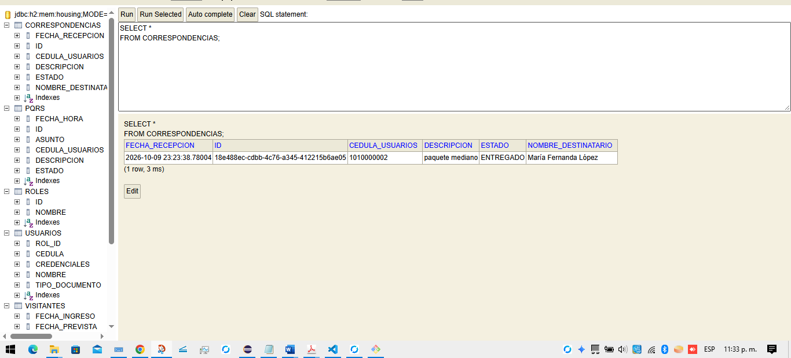

# Descripción técnica — HU-04: Registrador de correspondencia

*Proyecto Housing Control (`houstingcontrol-software`). Documentada con la estructura de la guía técnica de `refugio-heredado`, aplicada a esta historia en [`guia-tecnica-hu04.md`](./guia-tecnica-hu04.md).*

> Este documento se centra en **el código Java**: qué hace cada archivo, cómo se conectan y cómo se prueba. Para el stack, el árbol de carpetas y cómo ejecutar, ver la guía técnica. Los enlaces apuntan al commit `4f5c822`, así que siguen funcionando aunque la rama se fusione o se borre.

---

## 1. Qué hace HU-04

**Historia.** *Como portero, quiero registrar un paquete recibido para informar al residente y mantener trazabilidad.*

| Criterio de aceptación | Cómo lo cumple el código |
|---|---|
| Se registra destinatario | Siempre es un usuario registrado (`cedula_usuarios`); si no existe, 400 |
| Se registra descripción | Es obligatoria; si falta, 400 |
| Se registra fecha de recepción | La asigna el servicio con `LocalDateTime.now()` |
| Estado `RECIBIDO → NOTIFICADO → ENTREGADO` | Nace `RECIBIDO`; solo se avanza en ese orden; un salto responde 409 |

## 2. Dónde está el código

| Capa | Archivo | Qué hace |
|---|---|---|
| Entidad | [`Correspondencia.java`](https://github.com/lcardona3815-ship-it/houstingcontrol-software/blob/4f5c822db6927e69c3bba3a1fb77b6e8a2192dcb/backend/walkin-skeleton/software/src/main/java/com/housingcontrol/software/domain/Correspondencia.java) | La tabla `correspondencias` y las reglas de transición (`notificar`, `entregar`) |
| Entidad | [`EstadoPaquete.java`](https://github.com/lcardona3815-ship-it/houstingcontrol-software/blob/4f5c822db6927e69c3bba3a1fb77b6e8a2192dcb/backend/walkin-skeleton/software/src/main/java/com/housingcontrol/software/domain/EstadoPaquete.java) | Los tres estados válidos |
| DTO | [`RegistrarCorrespondenciaDTO.java`](https://github.com/lcardona3815-ship-it/houstingcontrol-software/blob/4f5c822db6927e69c3bba3a1fb77b6e8a2192dcb/backend/walkin-skeleton/software/src/main/java/com/housingcontrol/software/application/dto/RegistrarCorrespondenciaDTO.java) | El cuerpo JSON de entrada (`descripcion`, `cedula_usuarios`) |
| Servicio | [`CorrespondenciaService.java`](https://github.com/lcardona3815-ship-it/houstingcontrol-software/blob/4f5c822db6927e69c3bba3a1fb77b6e8a2192dcb/backend/walkin-skeleton/software/src/main/java/com/housingcontrol/software/application/service/CorrespondenciaService.java) | Registrar, notificar y entregar; valida y coordina |
| Controlador | [`CorrespondenciaController.java`](https://github.com/lcardona3815-ship-it/houstingcontrol-software/blob/4f5c822db6927e69c3bba3a1fb77b6e8a2192dcb/backend/walkin-skeleton/software/src/main/java/com/housingcontrol/software/infrastructure/controller/CorrespondenciaController.java) | Las 3 rutas HTTP y su traducción a 201/200/400/404/409 |
| Repositorio | [`CorrespondenciaRepository.java`](https://github.com/lcardona3815-ship-it/houstingcontrol-software/blob/4f5c822db6927e69c3bba3a1fb77b6e8a2192dcb/backend/walkin-skeleton/software/src/main/java/com/housingcontrol/software/infrastructure/repository/CorrespondenciaRepository.java) | Acceso a datos (Spring escribe la implementación) |

En total, **207 líneas de Java** de código de aplicación y **563 líneas** de pruebas (24 pruebas) en 12 archivos.

## 3. Arquitectura y flujo

```
HTTP ──▶ CorrespondenciaController ──▶ CorrespondenciaService ──▶ Correspondencia (entidad)
                  traduce errores a            valida, busca al             conoce sus reglas
                  códigos HTTP                 destinatario, coordina       de transición
                                                      │
                                                      ▼
                                        CorrespondenciaRepository ──▶ base de datos
```

**El controlador traduce, el servicio coordina, la entidad conoce sus reglas, el repositorio no piensa.** Las capas son `domain/`, `application/` e `infrastructure/`.

## 4. Modelo de datos

Esquema real de PostgreSQL (`database/v1-initial-schema.sql`):

```sql
CREATE TYPE estado_paquete_enum AS ENUM ('RECIBIDO', 'NOTIFICADO', 'ENTREGADO');

CREATE TABLE correspondencias (
    id UUID PRIMARY KEY DEFAULT gen_random_uuid(),
    descripcion TEXT,
    fecha_recepcion TIMESTAMP NOT NULL DEFAULT CURRENT_TIMESTAMP,
    estado estado_paquete_enum NOT NULL,
    nombre_destinatario VARCHAR(255) NOT NULL,
    cedula_usuarios VARCHAR(50) REFERENCES usuarios(cedula) ON DELETE CASCADE
);
```

| Columna | Campo Java | Nota |
|---|---|---|
| `id` | `UUID id` | generado (`GenerationType.UUID`) |
| `descripcion` | `String descripcion` | `TEXT` |
| `fecha_recepcion` | `LocalDateTime fechaRecepcion` | la asigna el servicio |
| `estado` | `String estado` | texto; en PostgreSQL es el tipo `estado_paquete_enum` |
| `nombre_destinatario` | `String nombreDestinatario` | copia el nombre del usuario al registrar |
| `cedula_usuarios` | `String cedulaUsuarios` | referencia a `usuarios(cedula)` |

Con el perfil `h2` (sin Docker) Hibernate genera la tabla desde la entidad; con PostgreSQL se usa el esquema de arriba.

## 5. API

| Ruta | Qué hace | Responde |
|---|---|---|
| `POST /api/correspondencias` | registra (nace `RECIBIDO`) | 201 · 400 |
| `PATCH /api/correspondencias/{id}/notificar` | `RECIBIDO → NOTIFICADO` | 200 · 404 · 409 |
| `PATCH /api/correspondencias/{id}/entregar` | `NOTIFICADO → ENTREGADO` | 200 · 404 · 409 |

Petición:

```json
{"descripcion":"paquete mediano","cedula_usuarios":"1010000002"}
```

Respuesta real (de `docs/evidencia-hu04-demo.txt`, el id y la fecha cambian en cada ejecución):

```json
{"cedulaUsuarios":"1010000002","descripcion":"paquete mediano","estado":"RECIBIDO","fechaRecepcion":"2026-10-10T00:41:32.7085135","id":"c94b99f9-ec68-446a-b101-b2078beaa416","nombreDestinatario":"María Fernanda López"}
```

## 6. El código Java

Los seis archivos de HU-04, tal como están en el repositorio.

### Correspondencia.java

`backend/walkin-skeleton/software/src/main/java/com/housingcontrol/software/domain/Correspondencia.java` · [ver en GitHub](https://github.com/lcardona3815-ship-it/houstingcontrol-software/blob/4f5c822db6927e69c3bba3a1fb77b6e8a2192dcb/backend/walkin-skeleton/software/src/main/java/com/housingcontrol/software/domain/Correspondencia.java)

```java
package com.housingcontrol.software.domain;

import jakarta.persistence.*;
import java.time.LocalDateTime;
import java.util.UUID;

@Entity
@Table(name = "correspondencias")
public class Correspondencia {

    @Id
    @GeneratedValue(strategy = GenerationType.UUID)
    private UUID id;

    @Column(columnDefinition = "TEXT")
    private String descripcion;

    @Column(name = "fecha_recepcion", nullable = false)
    private LocalDateTime fechaRecepcion;

    @Column(nullable = false)
    private String estado;

    @Column(name = "nombre_destinatario", nullable = false)
    private String nombreDestinatario;

    @Column(name = "cedula_usuarios")
    private String cedulaUsuarios;

    public Correspondencia() {}

    public UUID getId() { return id; }

    public String getDescripcion() { return descripcion; }
    public void setDescripcion(String descripcion) { this.descripcion = descripcion; }

    public LocalDateTime getFechaRecepcion() { return fechaRecepcion; }
    public void setFechaRecepcion(LocalDateTime fechaRecepcion) { this.fechaRecepcion = fechaRecepcion; }

    public String getEstado() { return estado; }
    public void setEstado(String estado) { this.estado = estado; }

    public String getNombreDestinatario() { return nombreDestinatario; }
    public void setNombreDestinatario(String nombreDestinatario) { this.nombreDestinatario = nombreDestinatario; }

    public String getCedulaUsuarios() { return cedulaUsuarios; }
    public void setCedulaUsuarios(String cedulaUsuarios) { this.cedulaUsuarios = cedulaUsuarios; }

    /** RECIBIDO -> NOTIFICADO. Cualquier otro estado de origen es inválido. */
    public void notificar() {
        cambiarEstado(EstadoPaquete.RECIBIDO, EstadoPaquete.NOTIFICADO);
    }

    /** NOTIFICADO -> ENTREGADO. No se puede entregar sin haber notificado. */
    public void entregar() {
        cambiarEstado(EstadoPaquete.NOTIFICADO, EstadoPaquete.ENTREGADO);
    }

    private void cambiarEstado(EstadoPaquete esperado, EstadoPaquete nuevo) {
        if (!esperado.name().equals(this.estado)) {
            throw new IllegalStateException(
                "Transición inválida: el paquete está " + this.estado
                + " y solo puede pasar a " + nuevo.name() + " desde " + esperado.name());
        }
        this.estado = nuevo.name();
    }
}
```

### EstadoPaquete.java

`backend/walkin-skeleton/software/src/main/java/com/housingcontrol/software/domain/EstadoPaquete.java` · [ver en GitHub](https://github.com/lcardona3815-ship-it/houstingcontrol-software/blob/4f5c822db6927e69c3bba3a1fb77b6e8a2192dcb/backend/walkin-skeleton/software/src/main/java/com/housingcontrol/software/domain/EstadoPaquete.java)

```java
package com.housingcontrol.software.domain;

public enum EstadoPaquete {
    RECIBIDO, NOTIFICADO, ENTREGADO
}
```

### RegistrarCorrespondenciaDTO.java

`backend/walkin-skeleton/software/src/main/java/com/housingcontrol/software/application/dto/RegistrarCorrespondenciaDTO.java` · [ver en GitHub](https://github.com/lcardona3815-ship-it/houstingcontrol-software/blob/4f5c822db6927e69c3bba3a1fb77b6e8a2192dcb/backend/walkin-skeleton/software/src/main/java/com/housingcontrol/software/application/dto/RegistrarCorrespondenciaDTO.java)

```java
package com.housingcontrol.software.application.dto;

import com.fasterxml.jackson.annotation.JsonProperty;

public record RegistrarCorrespondenciaDTO(
        String descripcion,
        @JsonProperty("cedula_usuarios") String cedulaUsuarios) {
}
```

### CorrespondenciaService.java

`backend/walkin-skeleton/software/src/main/java/com/housingcontrol/software/application/service/CorrespondenciaService.java` · [ver en GitHub](https://github.com/lcardona3815-ship-it/houstingcontrol-software/blob/4f5c822db6927e69c3bba3a1fb77b6e8a2192dcb/backend/walkin-skeleton/software/src/main/java/com/housingcontrol/software/application/service/CorrespondenciaService.java)

```java
package com.housingcontrol.software.application.service;

import com.housingcontrol.software.application.dto.RegistrarCorrespondenciaDTO;
import com.housingcontrol.software.domain.Correspondencia;
import com.housingcontrol.software.domain.EstadoPaquete;
import com.housingcontrol.software.domain.Usuario;
import com.housingcontrol.software.infrastructure.repository.CorrespondenciaRepository;
import com.housingcontrol.software.infrastructure.repository.UsuarioRepository;
import java.time.LocalDateTime;
import java.util.UUID;
import org.springframework.stereotype.Service;

@Service
public class CorrespondenciaService {

    private final CorrespondenciaRepository correspondenciaRepository;
    private final UsuarioRepository usuarioRepository;

    public CorrespondenciaService(CorrespondenciaRepository correspondenciaRepository,
                                  UsuarioRepository usuarioRepository) {
        this.correspondenciaRepository = correspondenciaRepository;
        this.usuarioRepository = usuarioRepository;
    }

    public Correspondencia registrar(RegistrarCorrespondenciaDTO dto) {
        if (esVacio(dto.descripcion()) || esVacio(dto.cedulaUsuarios())) {
            throw new IllegalArgumentException("Destinatario y descripción son obligatorios");
        }
        Usuario destinatario = usuarioRepository.findById(dto.cedulaUsuarios())
                .orElseThrow(() -> new IllegalArgumentException("El destinatario no existe"));

        Correspondencia correspondencia = new Correspondencia();
        correspondencia.setDescripcion(dto.descripcion());
        correspondencia.setCedulaUsuarios(dto.cedulaUsuarios());
        correspondencia.setNombreDestinatario(destinatario.getNombre());
        correspondencia.setFechaRecepcion(LocalDateTime.now());
        correspondencia.setEstado(EstadoPaquete.RECIBIDO.name());

        return correspondenciaRepository.save(correspondencia);
    }

    public Correspondencia notificar(UUID id) {
        Correspondencia correspondencia = buscar(id);
        correspondencia.notificar();
        return correspondenciaRepository.save(correspondencia);
    }

    public Correspondencia entregar(UUID id) {
        Correspondencia correspondencia = buscar(id);
        correspondencia.entregar();
        return correspondenciaRepository.save(correspondencia);
    }

    private Correspondencia buscar(UUID id) {
        return correspondenciaRepository.findById(id)
                .orElseThrow(() -> new IllegalArgumentException("El paquete no existe"));
    }

    private boolean esVacio(String texto) {
        return texto == null || texto.isBlank();
    }
}
```

### CorrespondenciaController.java

`backend/walkin-skeleton/software/src/main/java/com/housingcontrol/software/infrastructure/controller/CorrespondenciaController.java` · [ver en GitHub](https://github.com/lcardona3815-ship-it/houstingcontrol-software/blob/4f5c822db6927e69c3bba3a1fb77b6e8a2192dcb/backend/walkin-skeleton/software/src/main/java/com/housingcontrol/software/infrastructure/controller/CorrespondenciaController.java)

```java
package com.housingcontrol.software.infrastructure.controller;

import com.housingcontrol.software.application.dto.RegistrarCorrespondenciaDTO;
import com.housingcontrol.software.application.service.CorrespondenciaService;
import com.housingcontrol.software.domain.Correspondencia;
import java.util.Map;
import java.util.UUID;
import org.springframework.http.HttpStatus;
import org.springframework.http.ResponseEntity;
import org.springframework.web.bind.annotation.*;

@RestController
@RequestMapping("/api/correspondencias")
public class CorrespondenciaController {

    private final CorrespondenciaService correspondenciaService;

    public CorrespondenciaController(CorrespondenciaService correspondenciaService) {
        this.correspondenciaService = correspondenciaService;
    }

    @PostMapping
    public ResponseEntity<?> registrar(@RequestBody RegistrarCorrespondenciaDTO dto) {
        try {
            Correspondencia correspondencia = correspondenciaService.registrar(dto);
            return ResponseEntity.status(HttpStatus.CREATED).body(correspondencia);
        } catch (IllegalArgumentException e) {
            return ResponseEntity.badRequest().body(Map.of("mensaje", e.getMessage()));
        }
    }

    /** RECIBIDO -> NOTIFICADO. 404 si el paquete no existe, 409 si la transición no es válida. */
    @PatchMapping("/{id}/notificar")
    public ResponseEntity<?> notificar(@PathVariable UUID id) {
        try {
            return ResponseEntity.ok(correspondenciaService.notificar(id));
        } catch (IllegalArgumentException e) {
            return ResponseEntity.status(HttpStatus.NOT_FOUND).body(Map.of("mensaje", e.getMessage()));
        } catch (IllegalStateException e) {
            return ResponseEntity.status(HttpStatus.CONFLICT).body(Map.of("mensaje", e.getMessage()));
        }
    }

    /** NOTIFICADO -> ENTREGADO. 404 si el paquete no existe, 409 si la transición no es válida. */
    @PatchMapping("/{id}/entregar")
    public ResponseEntity<?> entregar(@PathVariable UUID id) {
        try {
            return ResponseEntity.ok(correspondenciaService.entregar(id));
        } catch (IllegalArgumentException e) {
            return ResponseEntity.status(HttpStatus.NOT_FOUND).body(Map.of("mensaje", e.getMessage()));
        } catch (IllegalStateException e) {
            return ResponseEntity.status(HttpStatus.CONFLICT).body(Map.of("mensaje", e.getMessage()));
        }
    }
}
```

### CorrespondenciaRepository.java

`backend/walkin-skeleton/software/src/main/java/com/housingcontrol/software/infrastructure/repository/CorrespondenciaRepository.java` · [ver en GitHub](https://github.com/lcardona3815-ship-it/houstingcontrol-software/blob/4f5c822db6927e69c3bba3a1fb77b6e8a2192dcb/backend/walkin-skeleton/software/src/main/java/com/housingcontrol/software/infrastructure/repository/CorrespondenciaRepository.java)

```java
package com.housingcontrol.software.infrastructure.repository;

import com.housingcontrol.software.domain.Correspondencia;
import java.util.UUID;
import org.springframework.data.jpa.repository.JpaRepository;
import org.springframework.stereotype.Repository;

@Repository
public interface CorrespondenciaRepository extends JpaRepository<Correspondencia, UUID> {
}
```

**Decisiones de diseño que se ven en el código**

- **La regla de transición vive en la entidad.** `cambiarEstado` solo permite avanzar si el estado actual es el esperado; así, ningún controlador ni servicio puede saltarse el orden por error.
- **El servicio coordina.** Valida los datos, busca al destinatario, asigna la fecha y el estado inicial y persiste.
- **El controlador traduce.** Convierte `IllegalArgumentException` en 400 (al registrar) o 404 (al cambiar de estado), e `IllegalStateException` en 409.
- **`@JsonProperty("cedula_usuarios")`** mantiene el JSON en `snake_case` mientras el código usa `camelCase`.

## 7. Pruebas

| Archivo | Tipo | Qué cubre | Pruebas |
|---|---|---|---|
| [`CorrespondenciaServiceTest.java`](https://github.com/lcardona3815-ship-it/houstingcontrol-software/blob/4f5c822db6927e69c3bba3a1fb77b6e8a2192dcb/backend/walkin-skeleton/software/src/test/java/com/housingcontrol/software/application/service/CorrespondenciaServiceTest.java) | Unitaria (Mockito) | `registrar` con repositorios falsos | 4 |
| [`CorrespondenciaEstadoServiceTest.java`](https://github.com/lcardona3815-ship-it/houstingcontrol-software/blob/4f5c822db6927e69c3bba3a1fb77b6e8a2192dcb/backend/walkin-skeleton/software/src/test/java/com/housingcontrol/software/application/service/CorrespondenciaEstadoServiceTest.java) | Unitaria (Mockito) | `notificar` y `entregar` con repositorios falsos | 5 |
| [`CorrespondenciaControllerTest.java`](https://github.com/lcardona3815-ship-it/houstingcontrol-software/blob/4f5c822db6927e69c3bba3a1fb77b6e8a2192dcb/backend/walkin-skeleton/software/src/test/java/com/housingcontrol/software/infrastructure/controller/CorrespondenciaControllerTest.java) | Controlador, servicio simulado | códigos HTTP de `registrar` | 2 |
| [`CorrespondenciaEstadoControllerTest.java`](https://github.com/lcardona3815-ship-it/houstingcontrol-software/blob/4f5c822db6927e69c3bba3a1fb77b6e8a2192dcb/backend/walkin-skeleton/software/src/test/java/com/housingcontrol/software/infrastructure/controller/CorrespondenciaEstadoControllerTest.java) | Controlador, servicio simulado | códigos HTTP de `notificar` y `entregar` | 6 |
| [`CorrespondenciaIntegrationTest.java`](https://github.com/lcardona3815-ship-it/houstingcontrol-software/blob/4f5c822db6927e69c3bba3a1fb77b6e8a2192dcb/backend/walkin-skeleton/software/src/test/java/com/housingcontrol/software/infrastructure/controller/CorrespondenciaIntegrationTest.java) | Integración (H2 real) | `registrar` por HTTP contra la base | 3 |
| [`CorrespondenciaEstadoIntegrationTest.java`](https://github.com/lcardona3815-ship-it/houstingcontrol-software/blob/4f5c822db6927e69c3bba3a1fb77b6e8a2192dcb/backend/walkin-skeleton/software/src/test/java/com/housingcontrol/software/infrastructure/controller/CorrespondenciaEstadoIntegrationTest.java) | Integración (H2 real) | flujo completo RECIBIDO → NOTIFICADO → ENTREGADO por HTTP | 4 |
| **Total HU-04** | | | **24** |

<details><summary>Nombre de cada prueba</summary>

**CorrespondenciaServiceTest**

- `registraPaqueteConEstadoRecibidoYFechaDeRecepcion`
- `rechazaSiElDestinatarioNoExiste`
- `rechazaSiFaltaLaDescripcion`
- `rechazaSiFaltaElDestinatario`

**CorrespondenciaEstadoServiceTest**

- `notificaPaqueteRecibidoYPasaANotificado`
- `entregaPaqueteNotificadoYPasaAEntregado`
- `rechazaEntregarSiElPaqueteNoFueNotificado`
- `rechazaNotificarSiElPaqueteYaFueNotificado`
- `rechazaCambiarEstadoSiElPaqueteNoExiste`

**CorrespondenciaControllerTest**

- `registroValidoResponde201`
- `registroInvalidoResponde400`

**CorrespondenciaEstadoControllerTest**

- `notificarPaqueteValidoResponde200`
- `notificarPaqueteInexistenteResponde404`
- `notificarConTransicionInvalidaResponde409`
- `entregarPaqueteValidoResponde200`
- `entregarPaqueteInexistenteResponde404`
- `entregarSinHaberNotificadoResponde409`

**CorrespondenciaIntegrationTest**

- `registroValidoResponde201YQuedaGuardadoComoRecibido`
- `sinDescripcionResponde400YNoGuardaNada`
- `destinatarioInexistenteResponde400YNoGuardaNada`

**CorrespondenciaEstadoIntegrationTest**

- `flujoCompletoRecibidoNotificadoEntregadoQuedaGuardadoEnBaseDeDatos`
- `entregarSinNotificarResponde409YElEstadoSigueRecibido`
- `notificarDosVecesResponde409YElEstadoSigueNotificado`
- `cambiarEstadoDePaqueteInexistenteResponde404`

</details>

**Resultado** (`./mvnw test`, [`docs/evidencia-hu04.txt`](./evidencia-hu04.txt)): `Tests run: 36, Failures: 0, Errors: 0, Skipped: 0` en todo el proyecto, `BUILD SUCCESS`.

**Sensibilidad de las pruebas.** Se introdujo cada defecto posible en la regla (aceptar un salto de estado, quitar una validación, no guardar) y se comprobó qué prueba falla; las 9 variantes quedaron detectadas. La tabla está en la sección 9.6 de la [guía técnica](./guia-tecnica-hu04.md).

## 8. Evidencia de funcionamiento

- Pruebas: [`evidencia-hu04.txt`](./evidencia-hu04.txt)
- Ejecución real de la API contra la base, con cada código HTTP verificado: [`evidencia-hu04-demo.txt`](./evidencia-hu04-demo.txt)
- Tabla en la consola H2 después del flujo completo:



Para reproducirla en cualquier equipo (Git Bash, desde la raíz del repo):

```bash
bash scripts/evidencia-hu04.sh --mantener
```

## 9. Historial de contribución

Commits que tocan el código o las pruebas de HU-04 (`git log -- <archivos de HU-04>`):

| Commit | Fecha | Autor | Mensaje |
|---|---|---|---|
| [`108c6f7`](https://github.com/lcardona3815-ship-it/houstingcontrol-software/commit/108c6f7096dd7d52105caa624d6c8f736b72eb49) | 2026-09-30 | Tu Nombre Completo | feat: HU-04 registrar correspondencia con pruebas unitarias e integracion |
| [`38df4d7`](https://github.com/lcardona3815-ship-it/houstingcontrol-software/commit/38df4d7d3bed03b4b8875d560eeaf0b5239530b0) | 2026-10-03 | Angela Maria Peñuela Alba | feat: HU-04 transición de estados RECIBIDO -> NOTIFICADO -> ENTREGADO con pruebas |
| [`3defdc0`](https://github.com/lcardona3815-ship-it/houstingcontrol-software/commit/3defdc06925c4834c48f1ecdc769ffecf927a068) | 2026-10-04 | Angela Maria Peñuela Alba | feat: HU-04 endpoints PATCH para notificar y entregar paquete con pruebas |
| [`e945a80`](https://github.com/lcardona3815-ship-it/houstingcontrol-software/commit/e945a80ca95ccadb2dec62068619f7de6fbedf67) | 2026-10-04 | Angela Maria Peñuela Alba | test: HU-04 prueba de integración del flujo RECIBIDO -> NOTIFICADO -> ENTREGADO por HTTP |
| [`9894641`](https://github.com/lcardona3815-ship-it/houstingcontrol-software/commit/9894641d4ec8e89342c0094d44e8fd7b9df20bbc) | 2026-10-10 | Angela Maria Peñuela Alba | docs+feat: guía técnica HU-04, perfil h2 con consola, script de evidencia y prueba reforzada |

Cada commit se puede abrir desde el enlace para ver exactamente qué cambió.

## 10. Limitaciones conocidas

El detalle, con el plan de cada una, está en [`deuda-tecnica.md`](./deuda-tecnica.md):

- Demo con Docker y PostgreSQL no ejecutada
- El esquema de las pruebas no es el esquema SQL del proyecto
- Pruebas del controlador con mocks
- La notificación no avisa al residente
- Sin control de concurrencia en el cambio de estado
- Sin historial de transiciones
- Diseño del modelo
- Por verificar
- Un mismo tipo de excepción significa dos errores distintos
