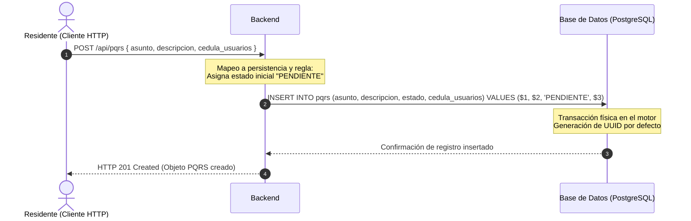

```mermaid

sequenceDiagram
    autonumber
    actor R as Residente (Cliente HTTP)
    participant B as Backend
    participant D as Base de Datos (PostgreSQL)

    R->>B: POST /api/pqrs { asunto, descripcion, cedula_usuarios }
    
    Note over B: Mapeo a persistencia y regla:<br/>Asigna estado inicial "PENDIENTE"
    
    B->>D: INSERT INTO pqrs (asunto, descripcion, estado, cedula_usuarios) VALUES ($1, $2, 'PENDIENTE', $3);
    
    Note over D: Transacción física en el motor<br/>Generación de UUID por defecto
    
    D-->>B: Confirmación de registro insertado
    B-->>R: HTTP 201 Created (Objeto PQRS creado)

```
