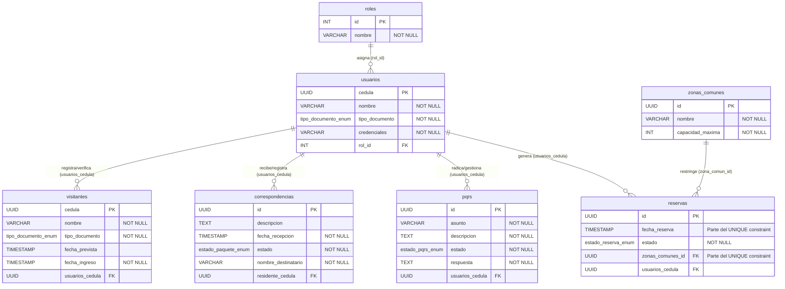

```mermaid
erDiagram
    %% Relaciones (Llaves Foráneas)
    roles ||--o{ usuarios : "asigna (rol_id)"
    usuarios ||--o{ visitantes : "registra/verifica (usuarios_cedula)"
    usuarios ||--o{ correspondencias : "recibe/registra (usuarios_cedula)"
    usuarios ||--o{ pqrs : "radica/gestiona (usuarios_cedula)"
    usuarios ||--o{ reservas : "genera (usuarios_cedula)"
    zonas_comunes ||--o{ reservas : "restringe (zona_comun_id)"

    %% Tablas y columnas
    roles {
        INT id PK
        VARCHAR nombre "NOT NULL"
    }

    usuarios {
        UUID cedula PK
        VARCHAR nombre "NOT NULL"
        tipo_documento_enum tipo_documento "NOT NULL"
        VARCHAR credenciales "NOT NULL"
        INT rol_id FK
    }

    zonas_comunes {
        UUID id PK
        VARCHAR nombre "NOT NULL"
        INT capacidad_maxima "NOT NULL"
    }

    visitantes {
        UUID cedula PK
        VARCHAR nombre "NOT NULL"
        tipo_documento_enum tipo_documento "NOT NULL"
        TIMESTAMP fecha_prevista 
        TIMESTAMP fecha_ingreso "NOT NULL"
        UUID usuarios_cedula FK
    }

    correspondencias {
        UUID id PK
        TEXT descripcion
        TIMESTAMP fecha_recepcion "NOT NULL"
        estado_paquete_enum estado "NOT NULL"
        VARCHAR nombre_destinatario "NOT NULL"
        UUID residente_cedula FK
    }

    pqrs {
        UUID id PK
        VARCHAR asunto "NOT NULL"
        TEXT descripcion "NOT NULL"
        estado_pqrs_enum estado "NOT NULL"
        TEXT respuesta "NOT NULL"
        UUID usuarios_cedula FK
    }

    reservas {
        UUID id PK
        TIMESTAMP fecha_reserva "Parte del UNIQUE constraint"
        estado_reserva_enum estado "NOT NULL"
        UUID zonas_comunes_id FK "Parte del UNIQUE constraint"
        UUID usuarios_cedula FK
    }
```
