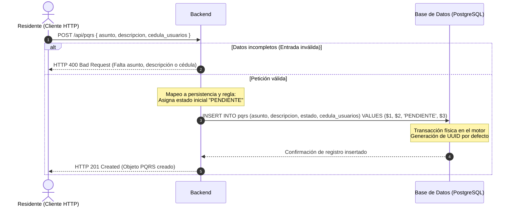
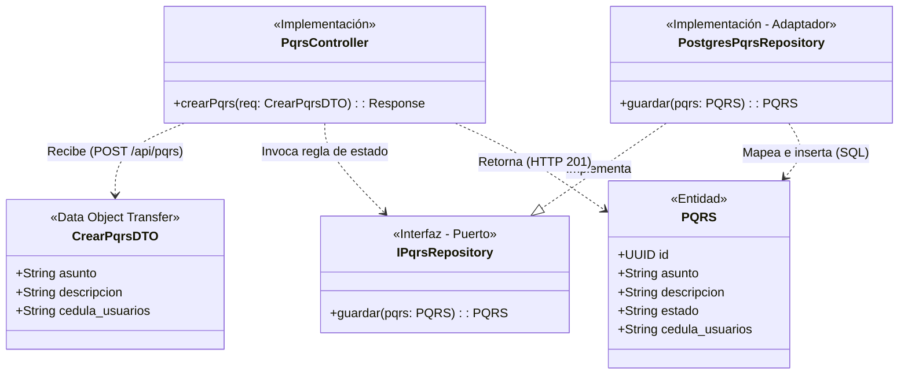

# Documentación del Esqueleto Andante (Walking Skeleton)

## TAREA 1 — Selección de rebanada

**Candidatas a Rebanada del Esqueleto**
*   **Candidata 1 (Elegida):** Registrar una PQRS recibiendo el asunto y la descripción, y guardándola con el estado inicial `PENDIENTE`.
*   **Candidata 2 (Descartada):** Reservar una zona común validando la disponibilidad de la fecha y el horario.

**Justificación de la candidata descartada**
La reserva de zonas comunes exige resolver la disponibilidad y concurrencia simultánea de horarios (el problema duro). Esto obliga a programar y depurar reglas complejas, concentrando el esfuerzo prematuramente en el dominio del negocio. El registro de PQRS garantiza la validación de toda la infraestructura aplicando una única regla de estado inicial por defecto.

**Fronteras técnicas cruzadas por la candidata elegida**
*   **Frontera HTTP/UI:** Captura del asunto y la descripción del residente mediante un cliente y recepción asíncrona en el servidor a través de una petición `POST`.
*   **Frontera de Aplicación / Dominio:** Procesamiento en el backend para generar el identificador y aplicar la regla de negocio que establece el estado de la solicitud como `PENDIENTE`.
*   **Frontera de Persistencia Real:** Mapeo estructurado del objeto en memoria utilizando Prisma ORM para preparar la inserción.
*   **Frontera de Base de Datos y Migración:** Ejecución física de la sentencia `INSERT INTO pqrs` en el motor relacional PostgreSQL para almacenar el registro de forma definitiva.

---

## TAREA 2 — Diagrama de secuencia (Artefacto principal)

# TAREA 3 — Diagrama de clases (Derivado)

# TAREA 4 — Contrato de la prueba única

**Especificación de Prueba End-to-End (E2E): Registro Exitoso de PQRS**

*   **Punto de entrada:** Cliente HTTP ejecutando una llamada a la ruta expuesta por el servidor backend: `POST /api/pqrs`.
*   **Precondición de datos:** El motor PostgreSQL está operando[cite: 1], las tablas del dominio están creadas, y existe un registro válido en la tabla `usuarios`[cite: 4] (ej. cédula "1010000004") para satisfacer la integridad referencial.
*   **Acción:** Se transmite una carga útil JSON válida hacia el backend: `{"asunto": "Fallo eléctrico", "descripcion": "Lámpara del pasillo fundida", "cedula_usuarios": "1010000004"}`[cite: 1, 4].
*   **Aserción observable:** El cliente HTTP intercepta un código de estado `HTTP 201 Created`. El cuerpo de la respuesta contiene el objeto de la PQRS generada, incluyendo un UUID válido[cite: 4] y el atributo `estado` con el valor exacto `"PENDIENTE"`[cite: 1].
*   **Estado esperado en la base de datos real:** Al consultar el motor físico (`SELECT * FROM pqrs WHERE id = [uuid_devuelto]`), se recupera exactamente una fila[cite: 4]. Los datos de la fila coinciden estrictamente con el payload enviado, y la columna `estado` es `"PENDIENTE"`[cite: 1, 4].

**Comprobación de fallos por ruptura de fronteras técnicas:**

*   **Entrada externa:** Falla si el enrutador rechaza la ruta, falta el middleware JSON, o el cliente envía una petición malformada.
*   **Aplicación:** Falla si la lógica del controlador omite aplicar la regla de negocio (forzar estado `"PENDIENTE"`)[cite: 1].
*   **Mapeo:** Falla si la capa de acceso a datos construye incorrectamente la instrucción `INSERT INTO pqrs`[cite: 4] (tipos de datos incompatibles o nombres de columnas erróneos).
*   **Driver:** Falla por *timeout* o conexión rechazada si la cadena de conexión hacia PostgreSQL[cite: 1] es incorrecta.
*   **Migración:** Falla mediante excepción SQL si la tabla `pqrs`[cite: 4] o sus columnas no existen físicamente.
*   **Base de datos:** Falla si el motor aborta el `INSERT` por violación de integridad referencial o restricción `NOT NULL`[cite: 4].
*   **Respuesta:** Falla si el controlador no logra serializar la entidad de vuelta tras una inserción exitosa, retornando `HTTP 500` en lugar de `HTTP 201 Created`.

# TAREA 5 — Trazabilidad

| Elemento del diagrama | Archivo de origen | Línea o sección que lo respalda |
| :--- | :--- | :--- |
| Actor: Residente | `historias-usuario.md` | HU-07 — Registrar PQRS ("Como residente, quiero registrar una PQRS")[cite: 1]. |
| Participante: Backend (Express) | `historias-usuario.md` | Flujo trivial de extremo a extremo / Stack confirmado ("Express")[cite: 1]. |
| Participante: Base de Datos (PostgreSQL) | `historias-usuario.md` | Stack confirmado ("PostgreSQL")[cite: 1]. |
| Atributos de entrada: `asunto`, `descripcion` | `historias-usuario.md` | HU-07 — Registrar PQRS ("registrar asunto", "escribir una descripción")[cite: 1]. |
| Llave foránea de entrada: `cedula_usuarios` | `modelo-DB.md` | Tabla `pqrs` (`VARCHAR cedula_usuarios FK`)[cite: 4]. |
| Regla de negocio: Estado inicial "PENDIENTE" | `historias-usuario.md` | HU-07 — Registrar PQRS ("Inicialmente queda en estado `PENDIENTE`") y Primera prueba unitaria (TDD)[cite: 1]. |
| Transacción de persistencia: `INSERT INTO pqrs` | `modelo-DB.md` | Tabla `pqrs`[cite: 4]. |
| Identificador: Generación de UUID | `modelo-DB.md` | Tabla `pqrs` (`UUID id PK`)[cite: 4]. |

### VACÍOS DETECTADOS

*   **Endpoint y Verbo HTTP (`POST /api/pqrs`):** Ningún insumo define la estructura de las rutas web ni el método HTTP para interactuar con el backend. Debería estar en un documento de contratos de API o diseño de integración.
*   **Códigos de Estado HTTP (`HTTP 201 Created`, `HTTP 400 Bad Request`):** Los insumos no detallan qué códigos de protocolo deben retornarse para el éxito de la operación o para el manejo de excepciones de validación (entradas inválidas). Debería estar en los criterios de aceptación técnicos o en una especificación Swagger/OpenAPI.