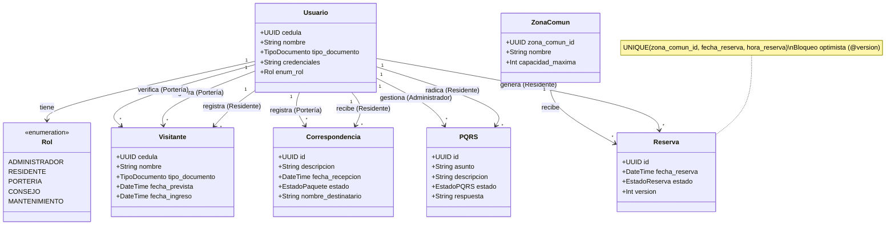

```mermaid
classDiagram
    class Usuario {
        +UUID cedula
        +String nombre
        +TipoDocumento tipo_documento
        +String credenciales
        +Rol enum_rol
    }

    class Rol {
        <<enumeration>>
        ADMINISTRADOR
        RESIDENTE
        PORTERIA
        CONSEJO
        MANTENIMIENTO
    }

    class Visitante {
        +UUID cedula
        +String nombre
        +TipoDocumento tipo_documento
        +DateTime fecha_prevista
        +DateTime fecha_ingreso
    }

    class Correspondencia {
        +UUID id
        +String descripcion
        +DateTime fecha_recepcion
        +EstadoPaquete estado
        +String nombre_destinatario
    }

    class ZonaComun {
        +UUID zona_comun_id
        +String nombre
        +Int capacidad_maxima
    }

    class Reserva {
        +UUID id
        +DateTime fecha_reserva
        +EstadoReserva estado
        +Int version
    }
    note for Reserva "UNIQUE(zona_comun_id, fecha_reserva, hora_reserva)\nBloqueo optimista (@version)"

    class PQRS {
        +UUID id
        +String asunto
        +String descripcion
        +EstadoPQRS estado
        +String respuesta
    }

    Usuario --> Rol : tiene
    Usuario "1" --> "*" Visitante : registra (Residente)
    Usuario "1" --> "*" Visitante : registra (Portería)
    Usuario "1" --> "*" Visitante : verifica (Portería)
    Usuario "1" --> "*" Correspondencia : recibe (Residente)
    Usuario "1" --> "*" Correspondencia : registra (Portería)
    Usuario "1" --> "*" Reserva : genera (Residente)
    ZonaComun "1" --> "*" Reserva : recibe
    Usuario "1" --> "*" PQRS : radica (Residente)
    Usuario "1" --> "*" PQRS : gestiona (Administrador)
```
